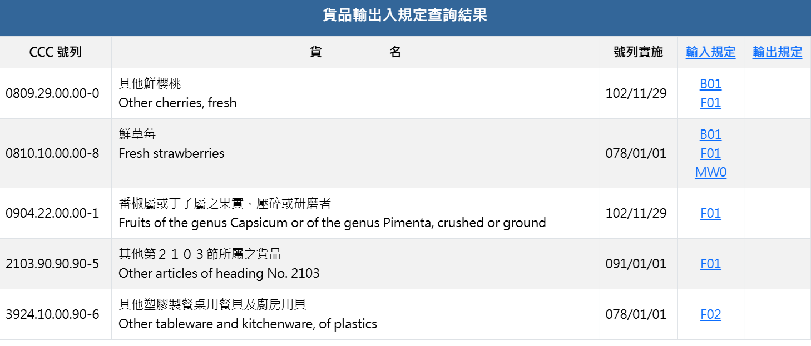

```{r setup, include=FALSE}
knitr::opts_chunk$set(echo = TRUE)
```

```{r}
# ADD libraries here
library(tidyverse)
library(readxl)
library(knitr)
library(kableExtra)
library(ggplot2)
library(dplyr)
library(stringr)
library(showtext)

font_add_google("Noto Sans TC", "NotoSans")
showtext_auto()
```

# AS02 Counting Data

```{r}
# 1. 讀取原始資料
raw_data <- read_csv("data/AS02_import_violations.csv")
# View(raw_data)

# 2. 資料清理與欄位選取 
data <- raw_data %>%
    # 先進行全欄位去重 (防止系統重複登錄)
    distinct() %>% 
  
    # 選取需要的欄位並重新命名為英文
    select(
        product = 主旨,
        category_code = 貨品分類號列,
        date = 發布日期,
        origin = 產地,
        importer = 進口商名稱,
        reason = 原因) %>%
    
    # 一次性清除所有文字欄位前後的隱形空格 (str_trim)
    mutate(across(where(is.character), str_trim)) 

# 3. 檢查一下清理後的成果
summary(data)
anyNA(data)
str(data)
head(data)
```

## Task 1. Count the number of occurrences for each violation category

Organize the results into a table, and display the top five rows of the sorted results. Use this table to answer the following questions:

-   How many distinct types of violation categories appear in the dataset?
-   What are the five most common violation categories?
-   Sort the results by frequency in descending order and display the top five rows of the resulting DataFrame.

因為不確定題目中的 `violation categories`是指 `主旨`（產品名稱）還是 `貨品分類號列`，因此決定兩個欄位都看看。

```{r}
product_analysis <- data %>%
  group_by(product) %>%
  summarise(frequency = n()) %>%
  arrange(desc(frequency))

# Get the number of distinct products
product_distinct <- nrow(product_analysis)

# Get the top 5
top_5_products <- head(product_analysis, 5)

print(product_distinct)
print(top_5_products)
```

```{r}
category_analysis <- data %>%
  group_by(category_code) %>%
  summarise(frequency = n()) %>%
  arrange(desc(frequency))

# Get the number of distinct categories
category_distinct <- nrow(category_analysis)

# Get the top 5
top_5_categories <- head(category_analysis, 5)

print(category_distinct)
print(top_5_categories)
# View(category_analysis)
```

檢視完以上的資料分析結果後，我決定採用 `貨品分類號列` 作為分組依據，而非 `主旨`（產品名稱），主要基於以下數據完整性的考量：

根據[全球紡織資訊網](https://www.tnet.org.tw/Article/Detail/29933)，`貨品分類號列` 欄位中的代碼是台灣專屬的進出口貨品分類號列（簡稱 C.C.C 號列）。CCC 號列是從國際商品統一分類制度（Harmonized System Code, HS code）演變而來，同類貨品有其專屬號列。相較之下，`主旨` 欄位屬於人工輸入的描述性文字，容易出現格式不一的問題。例如，同樣都是 `0810.10.00.00-8`，某些紀錄寫作 「鮮草莓」，而另一些則寫作 「草莓」。如果以 `主旨`進行統計，系統會將其視為兩個獨立項目，導致該類產品的違規總數被「低估」。使用 `貨品分類號列`編碼則能將這些變體正確地歸納在同一個項目下，確保統計結果的準確性。

但是若只用 C.C.C. 號列排序，讀者無法知道貨品實際是什麼，因此我在[經濟部國際貿易署](https://fbfh.trade.gov.tw/fh/ap/queryCCCRegFormf.do)找到每個號列對應的貨名。TOP 5 表格會同時並列找到的標準貨名與本資料集中該 C.C.C 號列最常出現的 `主旨` （產品名稱）。



```{r}
# 找出個別號列中，最常被提及的產品名稱
most_common_names <- data %>%
    group_by(category_code, product) %>%
    summarise(name_count = n()) %>%
    slice_max(name_count, n = 1, with_ties = F) %>% # 每個 code 只選出現次數最多的那一個名字
    select(category_code, most_common_name = product)

head(most_common_names)


# 合併所有資訊，並手動加入「官方標準貨名」
final_top_5_table <- top_5_categories %>%
    left_join(most_common_names, by = "category_code") %>%
    mutate(standard_name = case_when(
        category_code == "2103.90.90.90-5" ~ "其他第2103節所屬之貨品",
        category_code == "0810.10.00.00-8" ~ "鮮草莓",
        category_code == "0904.22.00.00-1" ~ "番椒屬或丁子屬之果實（壓碎或研磨者）",
        category_code == "0809.29.00.00-0" ~ "其他鮮櫻桃",
        category_code == "3924.10.00.90-6" ~ "其他塑膠製餐桌用餐具及廚房用具")) %>%
    # 最後調整欄位順序，讓表格更漂亮
    select(
        `貨名` = standard_name, 
        `最常見產品` = most_common_name, 
        `違規次數` = frequency
        )

final_top_5_table %>%
    kbl(caption = "台灣近三年前五大進口違規貨品統計") %>%
    kable_styling(bootstrap_options =
                      c("striped", "hover", "condensed"),
                        full_width = F)

```

::: {align="right" style="font-size: 0.85em; color: #555; line-height: 1.6; margin-top: 10px;"}
資料來源：衛生福利部食品藥物管理署 <br> 資料期間：2023.01.03 - 2026.03.10
:::

違規進口貨品共有 363 類。前五大進口違規貨品如上圖所示。

## Task 2. Repeat Offender Analysis for Importers

Examine whether the importers in the dataset show patterns of repeated violations. Before conducting the analysis, clearly state in your R Markdown (RMD) document how you define a “repeat offender.” For instance, you may define a repeat offender as an importer that appears more than a certain number of times in the violation records. After defining this criterion, complete the following tasks:

-   Identify all importers who meet your repeat-offender definition.
-   Calculate the total number of violations for each importer.
-   Rank the importers by their violation counts and report the top 10 importers with the highest number of violations.
-   Visualize the results by creating a horizontal bar chart showing the top 10 importers and their corresponding violation counts.

定義「何謂累犯」之前，先看一下進口商的違規次數分布情形。

```{r}
# 先計算每家進口商分別違規了幾次
importer_counts <- data %>%
    group_by(importer) %>%
    summarise(violation_count = n()) %>%
    arrange(desc(violation_count))

importer_counts

# 統計「犯幾次的人分別有幾個」& 所佔百分比
dist_data <- importer_counts %>%
    count(violation_count) %>%
    mutate(percentage = n / sum(n) * 100) # 順便算佔比

dist_data

# 計算累犯 3 次以上及 2 次以下的進口商，所犯案件的百分比
impact_analysis <- importer_counts %>%
    mutate(type = case_when(
        violation_count >= 3 ~ "犯 3次以上",
        TRUE ~ "犯 2次以下")) %>%
    group_by(type) %>%
    summarise(company_count = n(),  # 多少家公司
              total_violations = sum(violation_count)) %>%
    mutate(
        company_pct = company_count / sum(company_count) * 100,
        violation_pct = total_violations / sum(total_violations) * 100
  )

impact_analysis
```

在所有進口商中，違規次數僅 1 至 2 次者佔全體之 82%，顯示多數企業僅為偶發性不合格。然而，違規達 3 次（含）以上之企業雖僅佔 18%，卻包辦了自 2023 年至 2026 年 3 月 10 日間近 51% 的違規件數。鑑於這些少數廠商貢獻了過半的食安風險，故決定將**「累犯」**定義為：**於資料期間內累計違規達 3 次（含）以上之進口商**。

```{r}
# 根據定義篩選累犯，並計算次數
repeat_offenders <- importer_counts %>%
    filter(violation_count >= 3) 
repeat_offenders

# 累犯進口商總數
num_repeat_offenders <- nrow(repeat_offenders) 
num_repeat_offenders

# 取前 10 名
top_10_repeat_offenders <- head(repeat_offenders, 10)


# 使用 kable 呈現表格
top_10_repeat_offenders %>%
    kbl(caption = "台灣近三年十大違規累犯進口商") %>%
    kable_styling(bootstrap_options = 
                      c("striped", "hover", "condensed"),
                        full_width = F)
```

::: {align="right" style="font-size: 0.85em; color: #555; line-height: 1.6; margin-top: 10px;"}
資料來源：衛生福利部食品藥物管理署 <br> 資料期間：2023.01.03 - 2026.03.10
:::

```{r}
# Barplot Top 10 Repeated Offenders

ggplot(
    top_10_repeat_offenders, 
    aes(x = reorder(importer, violation_count), 
        y = violation_count)) +
    
    geom_col(fill = "#5D9CEC", 
             alpha = 0.8,
             width = 0.4) + 
        
    # 在長條末端加上數字標籤
    # hjust = -0.3 代表往右偏移一點
    geom_text(aes(label = violation_count), 
              hjust = -0.3, size = 5) +
    
    # 轉為橫向（Horizontal）
    coord_flip() + 
        
    # 設定標籤與標題
    labs(title = "台灣近三年十大違規累犯進口商：違規累計次數排行",
         caption = "資料來源：衛生福利部食品藥物管理署\n統計期間：2023.01.03 - 2026.03.10",
         x = NULL,
         y = NULL) +
                
    theme_minimal(base_family = "NotoSans",
                  base_size = 16 ) + 
            
    theme(axis.text.x = element_blank(),
          axis.ticks.x = element_blank(),
          panel.grid.major.x = element_blank(),
          axis.text.y = element_text(color = "black",
                                     size = 16),
          panel.grid.major.y = element_blank(),
          plot.title = element_text(face = "bold", 
                                    size = 20, 
                                    margin = margin(b = 15)),
          plot.caption = element_text(size = 12, 
                                      color = "#666666",
                                      lineheight = 0.8, 
                                      hjust = 1))

```

## Task 3. Designing a Data Journalism Angle (No Code)

Assume you are a data journalist who plans to write a data-driven news story based on this dataset. Identify the most important news question that could be investigated using the data.

-   What issue, pattern, or irregularity in the dataset appears most newsworthy?
-   What kinds of patterns or findings would you expect to observe after analyzing the data?
-   In approximately 200–300 words, describe the news angle you would pursue and explain why this angle would be meaningful to the public.

在回答 What is newsworthy 前，我覺得需要先檢視**五大違規進口貨品各別來自哪些產地？**以及**在這十大累犯進口商中，他們的供貨分別來自哪些產地？**

```{r}
# 檢視前五大違規進口貨品各別來自哪些產地？（各取前兩名並計算各別的百分比）
top5_CCC_origin <- data %>%
    filter(category_code %in% top_5_categories$category_code) %>%
    
    # 計算各別代碼的總違規次數 (為了算百分比的分母)
    group_by(category_code) %>%
    mutate(category_total = n()) %>%
    ungroup() %>%
    
    # 依照代碼與產地分組計算次數
    group_by(category_code, origin, category_total) %>%
    summarise(count = n(), .groups = "drop") %>%

    # 計算組內佔比 (%)
    mutate(percentage = round((count / category_total) * 100, 2)) %>%    

    # 在每個 CCC 內，只取 count 前兩名的資料
    group_by(category_code) %>%
    slice_max(order_by = count, n = 2, with_ties = FALSE) %>% 
    ungroup() %>%
    
    mutate(standard_name = case_when(
        category_code == "2103.90.90.90-5" ~ "其他第2103節所屬之貨品",
        category_code == "0810.10.00.00-8" ~ "鮮草莓",
        category_code == "0904.22.00.00-1" ~ "番椒屬或丁子屬之果實（壓碎或研磨者）",
        category_code == "0809.29.00.00-0" ~ "其他鮮櫻桃",
        category_code == "3924.10.00.90-6" ~ "其他塑膠製餐桌用餐具及廚房用具")) %>%
    
    arrange(category_code, desc(count)) %>%
    select(standard_name, origin, count, percentage)

top5_CCC_origin

```

```{r}
# 檢視十大累犯進口商，他們的供貨分別來自哪些產地？
top10_importer_origin <- data %>%
    filter(importer %in% top_10_repeat_offenders$importer) %>%
    
    # 將進口商名稱轉為 Factor，並依照 top10 的順序排列
    mutate(importer = factor(importer, levels = top_10_repeat_offenders$importer)) %>%
    
    # 計算每家進口商的「總違規次數」作為百分比分母
    group_by(importer) %>%
    mutate(importer_total = n()) %>%
    ungroup() %>%
    
    # 依照「進口商」與「產地」分組計算次數
    group_by(importer, origin, importer_total) %>%
    summarise(count = n(), .groups = "drop") %>%
    
    # 計算該產地佔該進口商的百分比 (%)
    mutate(percentage = round((count / importer_total) * 100, 2)) %>%
    
    # 每個進口商只取前兩名產地 
    group_by(importer) %>%
    slice_max(order_by = count, n = 2, with_ties = FALSE) %>% 
    ungroup() %>%
    
    # 排序：先按進口商總違規次數排，再按個別產地佔比排
    arrange(importer, desc(count)) %>%
    select(importer, origin, count, percentage)

top10_importer_origin


# 看看十大累犯進口商進口了哪些貨品？是否跟五大違規貨品有重疊？
top10_importer_detail <- data %>%
    
    filter(importer %in% top_10_repeat_offenders$importer) %>%
    
    mutate(standard_name = case_when(
        category_code == "2103.90.90.90-5" ~ "其他第2103節所屬之貨品",
        category_code == "0810.10.00.00-8" ~ "鮮草莓",
        category_code == "0904.22.00.00-1" ~ "番椒屬或丁子屬之果實（壓碎或研磨者）",
        category_code == "0809.29.00.00-0" ~ "其他鮮櫻桃",
        category_code == "3924.10.00.90-6" ~ "其他塑膠製餐桌用餐具及廚房用具",
        TRUE ~ category_code # 如果不在前五大貨名，標註為其他
    )) %>%
    
    # 按照 進口商、產地、貨名 分組計算
    group_by(importer, origin, standard_name) %>%
    summarise(violation_count = n(), .groups = "drop") %>%
 
    # 排序：確保順序跟著進口商排名走
    mutate(importer = factor(importer, levels = top_10_repeat_offenders$importer)) %>%
    arrange(importer, desc(violation_count))

top10_importer_detail

```

我認為本資料集中，最具新聞價值的現象在於**「風險的高度集中性」**。數據顯示，五大違規貨品中，違規「鮮草莓」有高達 94.9% 來自**日本**，違規「塑膠餐具或廚房用具」有 97.68% 集中於**中國**，違規「鮮櫻桃」則有 95.4% 來自**美國**與**智利**。此外，儘管十大違規累犯進口商的進口貨品與五大違規貨品未完全重疊，其中仍**有五家的違規貨品 100% 來自日本**，分別為上佳水果、豊漁貿易、東和水果、川咏水果與慕果生鮮水菓行。

這種**「單一產地、特定廠商、高頻率重複」**的現象，值得深入追問的是：進口商在追求獲利的同時，如何落實供應鏈管理與品管檢驗，而產地國的生產法規又是否足夠嚴謹。因此，報導焦點將從「什麼東西有毒」轉向**「為什麼違規會一再發生」**。

不過須注意的是，本資料集僅記錄「違規者」，若缺乏各貨品進口總量作為分母，便無法判斷這些違規案例是否在整體進口中佔有相當比例。

## Task 4. Finding Similar “Observational Record” Datasets (No Code)

Visit the open data platform, search open data published by 衛生福利部食品藥物管理署, and identify at least five datasets that are similar in nature to the dataset used in this assignment. Here, “similar” means that each record represents a single inspection, violation, report, or other observed event. For each dataset you identify, provide the dataset name, a brief description of the dataset contents, and the source link.

1.  [回收藥品資料集](https://data.gov.tw/dataset/6947)
    -   記載台灣市面上需要回收的藥品清單，包含回收分級及回收原因等。
    -   欄位：回收分級（第一級到第三級）、文號、日期、產品、許可證字號、批號、許可證持有者、原因
    -   補充：第一級危害指經許可製造、輸入之藥物，經發現有重大危害，或有發生重大損害之虞者。 第二級危害指經調查藥物確有損害使用生命、身體或健康之事實，或有損害之虞者。 第三級危害指其他危害事實，且具有造成使用者權益受損或安全之虞者。
    -   更新頻率：不定期更新
    -   最新資料涵蓋時間：2008 年 - 2026 年 3 月
2.  [市售食品中殘留動物用藥監測結果資料集](https://data.gov.tw/dataset/14187)
    -   針對市售魚肉類等產品（含加工品）進行動物用藥的抽驗結果。
    -   欄位：年度月份、抽樣衛生局、檢體名稱、抽樣廠商名稱、抽樣廠商地址、檢出項目及殘留容許量
    -   更新頻率：每年
    -   最新資料涵蓋時間：2021 年 - 2025 年
3.  [市售食品調查蔬果農藥殘留資料集](https://data.gov.tw/dataset/8935)
    -   各縣市衛生局對市售蔬果農產品進行農藥殘留監測的結果
    -   欄位：年度、月份區間（以兩個月為一單位）、分類、檢體名稱、農藥殘留量、抽樣衛生局、抽樣地點
    -   更新頻率：每三個月
    -   最新資料涵蓋時間：2021 年 - 2025 年
4.  [食品中毒案件原因食品案件數統計](https://data.gov.tw/dataset/9837)
    -   紀錄導致食物中毒的「食品類型」統計。
    -   欄位：年度、原因食品判明合計、水產品、水產加工品、肉類及其加工品、蛋類、乳類、穀類、蔬果類、糕餅糖果類、複合調理食品、其他、原因食品不明合計
    -   更新頻率：每年
    -   最新資料涵蓋時間：1981 年 - 2024 年
5.  [食品中毒案件攝食場所案件數統計](https://data.gov.tw/dataset/9838)
    -   紀錄發生食物中毒的「場所」統計。
    -   欄位：年度、場所類別（自宅、學校、營業場所、攤販、辦公場所等）
    -   更新頻率：每年
    -   最新資料涵蓋時間：1981 年 - 2024 年

## Task 5. Select one dataset for the preliminary data journalism proposal

From the datasets you identified in the previous task, choose the one you find most interesting and answer the following questions:

-   What event, issue, or phenomenon does this dataset primarily document? Briefly describe the real-world context represented in the data.

    我感興趣的資料集是[市售食品調查蔬果農藥殘留資料集](https://data.gov.tw/dataset/8935)。此資料集紀錄了 2021 年至 2025 年台灣市售蔬果農藥殘留監測的執行結果。各縣市衛生局定期派遣稽查人員前往全台各地果菜批發市場、量販店、連鎖超市、傳統市場及餐飲業者等進行隨機抽驗。此外，數據背後也反映了台灣農業在不同年度、不同月份區間的病蟲害防治挑戰。2023 年，《農傳媒》曾針對此計畫進行[報導](https://www.agriharvest.tw/archives/109948/)，但切入的 TA 角度為消費者端，且僅針對短期監測結果（7-8月）進行「點名式」分析，較難以看出潛在的系統性現象。

-   If you were to write a data-driven news story using this dataset, what would be the central question you want to investigate? Clearly formulate the key journalistic question that guides your analysis.

    根據我過往務農經驗，以及與周邊務農親戚的交談觀察發現，多數蔬果有其主要產季，在非適宜產季時，農友有時需要噴灑更多農藥以維持產量；又或者為了搶在產季初期的「頭一水」賣得好價錢，會需要更多農藥或人為「助力」。因此，透過此資料集，我想要詢問的是：**歷年來，台灣市售蔬果之農藥殘留不合格品項，在不同月份區間呈現什麼樣的分布？（切入角度：農民/（極端）氣候/ 維生）**

-   Which variables or fields in the dataset would you use to answer this question? (with Code) Identify the relevant columns and explain why they are useful for the analysis.

    我透過`農藥殘留量`欄位找出不合格品項；`年度`與`月份區間` 這兩個欄位則是回答「週期性」核心問題的關鍵。農藥殘留是否超標可能與氣候及農業耕作時程（如搶收期）密切相關。透過這兩個欄位，我們可以進行時間序列分析，找出歷年是否有特定蔬果的不合格高峰期，若可以搭配氣象資料，也可以觀察是否有極端氣候與農藥使用相關的趨勢變化。

    食安風險並非在所有作物上均勻分佈。透過 `檢體名稱`，可以區分出哪些是「高風險」品項。

    此外，雖然目前僅選取四個欄位，但未來可進一步利用 `抽樣地點` 欄位，透過提取關鍵字，將地點分類為「產地端」、「果菜批發」、「連鎖超市/量販店」、「傳統市場/零售攤商」及「餐飲店」等。將有助於探討不同販賣通路的差異，增加報導對消費者的實用性。

```{r}
raw_agri <- read_csv("data/AS02_市售食品調查蔬果農藥殘留資料集.csv")

# 資料清理與欄位選取 
failed_agri <- raw_agri %>%
    filter(農藥殘留量 != "合格") %>%
    
    select(
        year = 年度,
        month_range = 月份區間,
        item_name = 檢體名稱, 
        test_result = 農藥殘留量) %>%

    mutate(
        across(where(is.character), str_trim),
        year = year + 1911,
        # 讓月份區間變成有順序的因子 (Factor)
        month_range = factor(month_range, 
                             levels = c("1~2", "3~4", "5~6", "7~8", "9~10", "11~12"))
  )

anyNA(failed_agri)
summary(failed_agri)
str(failed_agri)
head(failed_agri)
```

-   Conduct a simple exploratory analysis of these variables (With Code). For example, frequency counts, cross-tabulations, or trend analysis over time.

```{r}
# 計算總不合格件數
total_fails <- nrow(failed_agri)
total_fails

#　抓出 Top 5 最常被抓到農藥殘留的品項
top_fail_items <- failed_agri %>%
    count(item_name) %>% 
    arrange(desc(n)) %>%    
    slice_head(n = 5) %>%          
    pull(item_name) # 把前五名抓出來變成一個清單

top_fail_items

# 計算 Top 5 品項的百分比
top_fail_summary <- failed_agri %>%
    count(item_name) %>%
    mutate(
        percentage = (n / total_fails) * 100) %>%
    arrange(desc(n)) %>%
    slice_head(n = 5)

top_fail_summary

# 算出這五大品項合計佔了多少百分比
top_5_total_share <- sum(top_fail_summary$percentage)
top_5_total_share

```

在初步探索中，若僅依據「農藥殘留不合格次數」排序，前五大品項分別為九層塔、白蘿蔔、香菜、茼蒿與韭菜花，合計佔不合格總件數的 17.13%。然而，此測量方式可能存在偏差，即不合格件數多可能僅是因為該品項的抽驗基數龐大。

```{r}
# 使用包含「合格」的原始資料
risk_analysis <- raw_agri %>%
    select(
        item_name = 檢體名稱, 
        test_result = 農藥殘留量) %>%
    
    group_by(item_name) %>%
  
    # 計算總抽驗次數與不合格次數
    summarise(
        total_inspected = n(), 
        fail_count = sum(test_result != "合格"),   
        failure_rate = (fail_count / total_inspected) * 100) %>%
  
    # 過濾掉抽驗次數太少的
    # 只將五年期間共抽驗過 30 次以上的品項列入比較
    filter(total_inspected >= 30) %>%
  
    # 按照不合格率排序
    arrange(desc(failure_rate))

head(risk_analysis, 10)

# 合併計算香菜與香菜(芫荽)
(21 + 73) / (53 + 207) * 100 # 36.15385
```

為了更精確地識別「高風險」品項，我將分析指標轉為**「不合格率（Failure Rate）」，並暫時先設定總抽驗次數需達 30 次（n ≥ 30）**為篩選門檻。

在計算過程中，我發現原始資料存在「同品項異名」的現象（例如：「香菜」與「香菜(芫荽)」被拆分為不同欄位）。目前先手動整合並計算這個品項的不合格率。

合併香菜品項後，前五大不合格率的品項分別為：大辣椒、甜豆、韭菜花、九層塔與荷蘭豆。主要為食材中的辛香料與豆類。暫居首位的大辣椒，不合格率更高達 51 %。

很有趣的是，根據我自己及家人的種植經驗，這五個作物（應該）都屬於「連續採收作物」。例如豆類與辣椒，農民在同一株植株上，會同時看到成熟待採的果實與剛開的花。為了保護嫩芽不被蟲咬，農民往往需要持續噴藥，導致已成熟的果實極易殘留農藥，難以符合「安全採收期」的規定。

```{r}
# 資料預處理 
market_risk_trend <- raw_agri %>%
    select(
        year = 年度,
        month_range = 月份區間,
        item_name = 檢體名稱,
        test_result = 農藥殘留量) %>%
    
    mutate(
        year = year + 1911,
        month_range = factor(month_range,
                             levels = c("1~2", "3~4", "5~6", "7~8", "9~10", "11~12")),
        is_fail = if_else(test_result == "合格", 0, 1)
  )

head(market_risk_trend)


# 定義五大高風險品項 (n >= 30 且 Rate 最高)
target_items <- c("大辣椒", "甜豆", "韭菜花", "九層塔", "荷蘭豆")

# 計算不分年度，每個「月份區間 + Top 5品項」的不合格率
# 不分年度的原因：因為有些品項某年度抽驗次數過低，不合格率會過度膨脹
plot_ready_data <- market_risk_trend %>%
    filter(item_name %in% target_items) %>%
    group_by(month_range, item_name) %>%
    summarise(
        total_inspected = n(),
        fail_count = sum(is_fail),
        fail_rate = (fail_count / total_inspected) * 100,
        .groups = "drop") %>%
    mutate(item_name = as.factor(item_name))


# 繪製歷年週期趨勢圖
ggplot(
    plot_ready_data, 
    aes(x = month_range, 
        y = fail_rate, 
        group = item_name, 
        color = item_name)
    ) +
    
    geom_line(linewidth = 0.8) +
        
    geom_point(aes(size = total_inspected), alpha = 0.7) +
    
    scale_color_brewer(palette = "Set2") +
      
    labs(
        title = "五大高風險蔬果農藥殘留：跨年度月份週期趨勢分析",
        caption = "資料來源：衛生福利部食品藥物管理署\n統計期間：2021 - 2025",
        x = "月份",
        y = "綜合不合格率 (%)",
        size = "總抽驗次數",
        color = "蔬果品項") +
    
    theme_minimal(
      base_family = "NotoSans", 
      base_size = 20) +

    theme(
      plot.title = element_text(face = "bold", 
                                size = 25, 
                                margin = margin(b = 15)),
      plot.caption = element_text(size = 15, 
                                  color = "#666666",
                                  lineheight = 0.8, 
                                  hjust = 1),
      legend.position = "right")
```

-   Based on your analysis, what preliminary observations or patterns can you identify? Describe any initial insights that emerge from the data
    -   部分分析已在前一題回答。
    -   Plot 完「五大高風險蔬果農藥殘留：跨年度月份週期趨勢分析」圖後，我發現若是把各品項資料根據 `月份週期` 拆開來計算**不合格率**，還是會出現單一品項因為該 `月份週期` 總抽驗次數過低，而有不合格率相對膨脹的情形（e.g. 大辣椒在 11-12 月份衝高到 100%）。
    -   目前的分析方式沒有把品項的**產季**與**產地等其他資訊**考慮進去。
        -   例如**甜豆與荷蘭豆**兩者**平地**產季相近，皆是在 11 月左右至隔年 4 月，但是在 `5~6` 月時，卻只有甜豆的不合格率從低谷飆升到約 60%，荷蘭豆則持平。荷蘭豆、甜豆就跟高麗菜一樣，會有**山區**農民在夏季（約 5月至10月）種植，填補平地夏季酷暑的缺口，同時也賺得更好的價錢， `5~6` 月時甜豆的不合格率飆升，我猜測還是跟農民要「逆天」種植所必須付出的農藥成本吧，但也僅是個人的猜測，因為同樣是豆類，荷蘭豆不合格率卻沒有一樣飆升。也有可能是甜豆本來就比荷蘭豆更容易有病蟲害，這點要向農民確認。
        -   根據 Google 網頁 AI 資訊，**九層塔**在春天 3 月至 5 月區間，容易因春雨多、積水而造成根腐病，夏季則因高溫潮濕易生蚜蟲、紅蜘蛛。不過，根據圖表，九層塔僅有 `3~4` 月區間有較高的不合格率（50%），夏天則較低（25%），這一點我覺得蠻有趣的。但是事實上九層塔是熱帶作物，我猜測夏天對它來說是「順勢」的生長季節，春天氣溫低不利生長，反而得透過更多農藥來除菌。除了詢問農民，這個困惑也許需要回到 Raw Data 看`農藥殘留量`標示的**超標農藥**為何。
    -   總結：想要探討某個現象還是得搭配多方的資訊來驗證，若未來想深挖這個主題，我希望可以結合**氣象資料**與**農業知識入口網**/**農民專業知識**，甚至是**農民收入`（若有`**）等資料。雖然農藥殘留超標對消費者來說可能是很恐慌的一件事，但是作為曾經務農的人，卻能夠深深體會**農民為什麼要冒著健康風險噴灑農藥背後的困境**。
